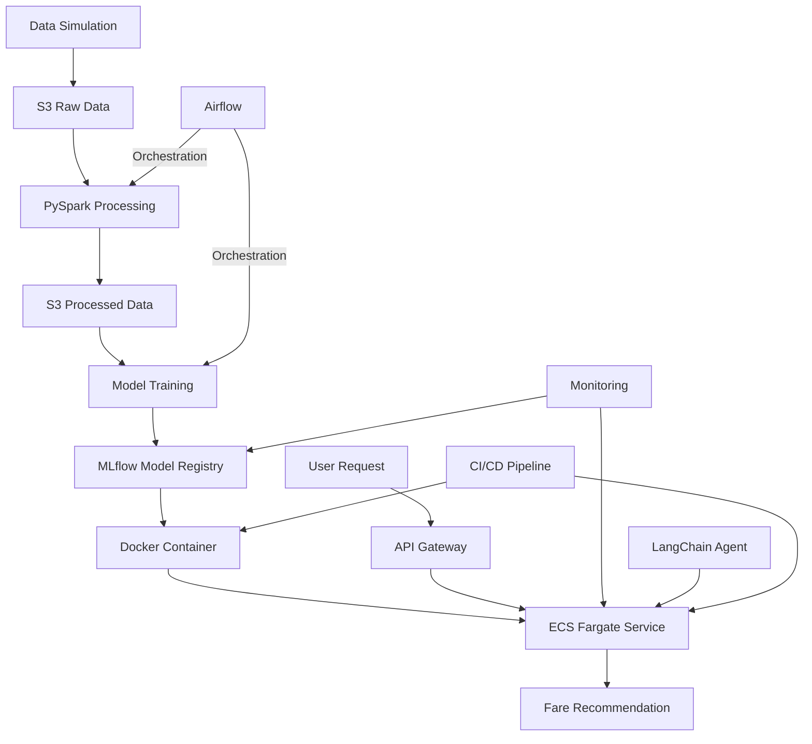

# Smart Fare Recommendation Engine with Full MLOps Pipeline on AWS

## Project Overview
This project implements a production-grade MLOps pipeline for a fare recommendation engine similar to those used by rail apps like Trainline. The system predicts optimal fare prices based on various factors such as origin, destination, booking time, and travel details.

## Architecture


## Tech Stack

| Component | Technology |
|-----------|------------|
| Infrastructure as Code | Terraform |
| Data Storage | AWS S3 |
| Data Processing | Apache Spark (EMR) |
| Model Training | LightGBM, MLflow |
| Containerization | Docker |
| Orchestration | Apache Airflow (MWAA) |
| Model Serving | FastAPI, ECS Fargate |
| CI/CD | GitHub Actions |
| Monitoring | Prometheus, Grafana, CloudWatch |
| Optional LLM Integration | LangChain, OpenAI GPT-4o |
| Frontend Demo | Streamlit |

## Project Structure
```
.
├── data/
│   ├── raw/                  # Raw simulated data
│   └── processed/            # Processed data ready for training
├── src/
│   ├── data/                 # Data processing scripts
│   │   ├── generate_data.py  # Data simulation script
│   │   └── process_data.py   # PySpark data processing
│   ├── model/                # Model training and evaluation
│   │   ├── train.py          # Model training script
│   │   └── evaluate.py       # Model evaluation script
│   ├── api/                  # API for model serving
│   │   ├── app.py            # FastAPI application
│   │   └── utils.py          # Utility functions
│   └── monitoring/           # Monitoring scripts
│       ├── drift_detection.py # Data drift detection
│       └── metrics.py        # Custom metrics collection
├── notebooks/                # Jupyter notebooks for exploration
├── tests/                    # Unit and integration tests
├── infra/                    # Infrastructure as code
│   ├── terraform/            # Terraform configurations
│   └── docker/               # Docker configurations
├── airflow/                  # Airflow DAGs
├── langchain_agent/          # Optional LangChain integration
├── .github/                  # GitHub Actions workflows
├── requirements.txt          # Python dependencies
└── README.md                 # Project documentation
```

## Setup Instructions

### Prerequisites
- AWS Account with appropriate permissions
- Terraform installed
- Docker installed
- Python 3.9+
- AWS CLI configured

### Local Development Setup
1. Clone the repository
2. Create a virtual environment: `python -m venv venv`
3. Activate the virtual environment: 
   - Windows: `venv\Scripts\activate`
   - Unix/MacOS: `source venv/bin/activate`
4. Install dependencies: `pip install -r requirements.txt`
5. Run data simulation: `python src/data/generate_data.py`

### Infrastructure Deployment
1. Navigate to the terraform directory: `cd infra/terraform`
2. Initialize Terraform: `terraform init`
3. Plan the deployment: `terraform plan -out=tfplan`
4. Apply the configuration: `terraform apply tfplan`

### Running the Pipeline
1. The Airflow DAGs will automatically trigger the data processing and model training pipelines
2. Monitor the progress through the Airflow UI
3. Access the model API through the provided endpoint after deployment

## CI/CD Pipeline
The CI/CD pipeline automates:
- Code linting and testing
- Model training when new data is available
- Docker image building and pushing to ECR
- Deployment to ECS via Terraform

## Monitoring
- MLflow for experiment tracking and model versioning
- Prometheus and Grafana for infrastructure and application monitoring
- Custom drift detection for model and data quality

## LangChain Integration
The optional LangChain agent provides a natural language interface to the fare recommendation engine, allowing users to query for fare recommendations using plain English.

## License


